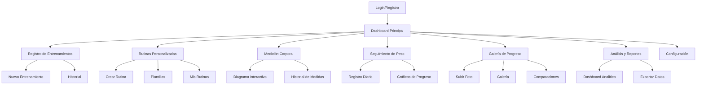

# Documento de Requerimientos del Producto - FitTracker Pro v2.0

## 1. Resumen del Producto

FitTracker Pro v2.0 es una plataforma web moderna de seguimiento fitness que permite a los usuarios registrar y monitorear su progreso físico de manera integral. La aplicación migra de vanilla JavaScript a una arquitectura moderna con React 18 + Next.js 14/15, TypeScript, Tailwind CSS y Supabase como backend.

**Objetivo Principal:** Proporcionar una experiencia completa de seguimiento fitness con visualizaciones intuitivas, funcionalidad offline y diseño responsive para todos los dispositivos.

**Valor de Mercado:** Competir con aplicaciones líderes como MyFitnessPal y Strong, ofreciendo una experiencia superior con visualización anatómica interactiva y análisis avanzado de progreso.

## 2. Funcionalidades Principales

### 2.1 Roles de Usuario

| Rol | Método de Registro | Permisos Principales |
|-----|-------------------|---------------------|
| Usuario Gratuito | Email + contraseña | Registro básico de entrenamientos, peso corporal, hasta 5 fotos de progreso |
| Usuario Premium | Upgrade desde gratuito | Funcionalidades completas, rutinas ilimitadas, análisis avanzado, exportación de datos |
| Administrador | Invitación del sistema | Gestión de usuarios, análisis de uso, configuración del sistema |

### 2.2 Módulos de Funcionalidad

Nuestra plataforma fitness renovada consta de las siguientes páginas principales:

1. **Dashboard Principal**: estadísticas generales, gráficos de progreso, resumen de actividad reciente, métricas clave de rendimiento.
2. **Registro de Entrenamientos**: formulario de ejercicios, seguimiento de pesos levantados, cronómetro de descanso, historial detallado.
3. **Rutinas Personalizadas**: creador de rutinas semanales, plantillas predefinidas, programación de entrenamientos, gestión de días de descanso.
4. **Medición Corporal Interactiva**: diagrama anatómico 3D interactivo, registro de medidas por grupo muscular, comparación temporal, visualización de crecimiento.
5. **Seguimiento de Peso**: registro diario de peso corporal, gráficos de tendencias, cálculo de IMC, objetivos de peso.
6. **Galería de Progreso**: subida de fotos semanales/mensuales, comparación antes/después, organización por fechas, análisis visual.
7. **Análisis y Reportes**: estadísticas avanzadas, exportación de datos, informes de progreso, recomendaciones personalizadas.
8. **Configuración de Usuario**: perfil personal, preferencias de la app, configuración de notificaciones, gestión de suscripción.

### 2.3 Detalles de Páginas

| Página | Módulo | Descripción de Funcionalidad |
|--------|--------|-----------------------------|
| Dashboard Principal | Panel de Estadísticas | Mostrar métricas clave: entrenamientos completados, peso actual, cambio mensual, próxima rutina programada |
| Dashboard Principal | Gráficos de Progreso | Visualizar tendencias de peso corporal, volumen de entrenamiento, frecuencia semanal usando Chart.js |
| Dashboard Principal | Actividad Reciente | Listar últimos 5 entrenamientos, cambios de peso recientes, fotos de progreso más recientes |
| Registro de Entrenamientos | Formulario de Ejercicios | Seleccionar grupo muscular, ejercicio específico, registrar series (peso, repeticiones, RPE), cronómetro de descanso |
| Registro de Entrenamientos | Historial de Entrenamientos | Filtrar por fecha/grupo muscular, ver progreso por ejercicio, comparar rendimiento histórico |
| Rutinas Personalizadas | Creador de Rutinas | Arrastrar y soltar ejercicios, asignar días de la semana, configurar series/repeticiones objetivo, guardar plantillas |
| Rutinas Personalizadas | Biblioteca de Ejercicios | Base de datos de 200+ ejercicios categorizados, instrucciones con GIFs, músculos trabajados |
| Medición Corporal | Diagrama Anatómico | Modelo 3D interactivo del cuerpo humano, click en músculos para registrar medidas, visualización de cambios por colores |
| Medición Corporal | Registro de Medidas | Formulario para pecho, brazos, cintura, piernas, cuello, con validación de datos y sugerencias |
| Seguimiento de Peso | Registro Diario | Input de peso con fecha, cálculo automático de IMC, establecimiento de objetivos, recordatorios |
| Seguimiento de Peso | Análisis de Tendencias | Gráfico lineal de progreso, promedio móvil, predicción de objetivos, identificación de patrones |
| Galería de Progreso | Subida de Fotos | Captura desde cámara o subida de archivos, categorización (frontal, lateral, posterior), compresión automática |
| Galería de Progreso | Comparación Visual | Vista lado a lado de fotos por fechas, slider temporal, detección de cambios, métricas de progreso |
| Análisis y Reportes | Dashboard Analítico | KPIs de rendimiento, gráficos de volumen de entrenamiento, análisis de frecuencia, recomendaciones IA |
| Análisis y Reportes | Exportación de Datos | Generar PDFs de progreso, exportar CSV de entrenamientos, backup completo de datos |

## 3. Flujo Principal de Usuario

### Flujo de Usuario Estándar
1. **Registro/Login** → Autenticación con Supabase Auth
2. **Configuración Inicial** → Establecer objetivos, medidas base, preferencias
3. **Dashboard** → Visualizar resumen de progreso y métricas
4. **Registro de Entrenamiento** → Seleccionar rutina o crear entrenamiento libre
5. **Medición Corporal** → Registrar medidas usando diagrama interactivo
6. **Seguimiento de Peso** → Input diario de peso corporal
7. **Subida de Fotos** → Capturar progreso visual semanal/mensual
8. **Análisis** → Revisar reportes y tendencias de progreso

### Diagrama de Navegación

## 4. Diseño de Interfaz de Usuario

### 4.1 Estilo de Diseño

**Colores Principales:**
- Primario: #0EA5E9 (Sky Blue) - Energía y motivación
- Secundario: #10B981 (Emerald) - Crecimiento y progreso
- Acento: #F59E0B (Amber) - Logros y destacados
- Neutros: #1F2937 (Gray-800), #F9FAFB (Gray-50)

**Tipografía:**
- Fuente Principal: Inter (sans-serif) - Legibilidad moderna
- Fuente de Datos: JetBrains Mono - Números y métricas
- Tamaños: 12px (small), 14px (base), 16px (lg), 20px (xl), 24px (2xl)

**Estilo de Componentes:**
- Botones: Redondeados (8px), sombras sutiles, estados hover/active
- Cards: Bordes redondeados (12px), sombra suave, padding consistente
- Inputs: Bordes redondeados (6px), focus states con color primario
- Iconos: Heroicons v2, tamaño consistente 20px/24px

**Layout:**
- Sidebar fijo en desktop, drawer en mobile
- Grid system responsive con Tailwind CSS
- Espaciado consistente usando escala 4px (4, 8, 12, 16, 24, 32px)

### 4.2 Componentes de Interfaz

| Página | Módulo | Elementos UI |
|--------|--------|-------------|
| Dashboard Principal | Panel de Métricas | Cards con iconos, números grandes (32px), colores de estado, micro-animaciones |
| Dashboard Principal | Gráficos | Chart.js con tema personalizado, tooltips interactivos, leyendas claras, responsive |
| Registro de Entrenamientos | Formulario | Dropdowns estilizados, inputs numéricos con steppers, botones de acción prominentes |
| Rutinas Personalizadas | Creador | Drag & drop interface, cards de ejercicios, timeline semanal, botones de guardado |
| Medición Corporal | Diagrama 3D | Canvas interactivo, hotspots clickeables, modal de input, indicadores visuales de cambio |
| Seguimiento de Peso | Gráfico de Progreso | Line chart responsivo, zoom/pan, marcadores de objetivos, gradientes de color |
| Galería de Progreso | Grid de Fotos | Masonry layout, lightbox modal, filtros por fecha, botones de comparación |

### 4.3 Responsividad

**Estrategia Mobile-First:**
- Breakpoints: sm (640px), md (768px), lg (1024px), xl (1280px)
- Navegación: Sidebar colapsable → Bottom navigation en mobile
- Gráficos: Adaptación automática de tamaño, gestos touch para zoom
- Formularios: Inputs de tamaño táctil (44px mínimo), teclados optimizados
- Imágenes: Lazy loading, compresión automática, formatos WebP

**Optimizaciones Táctiles:**
- Botones con área mínima de 44x44px
- Gestos swipe para navegación entre secciones
- Pull-to-refresh en listas de datos
- Haptic feedback en acciones importantes

**PWA Features:**
- Instalación desde navegador
- Funcionalidad offline con Service Workers
- Notificaciones push para recordatorios
- Sincronización en background
- Almacenamiento local con IndexedDB