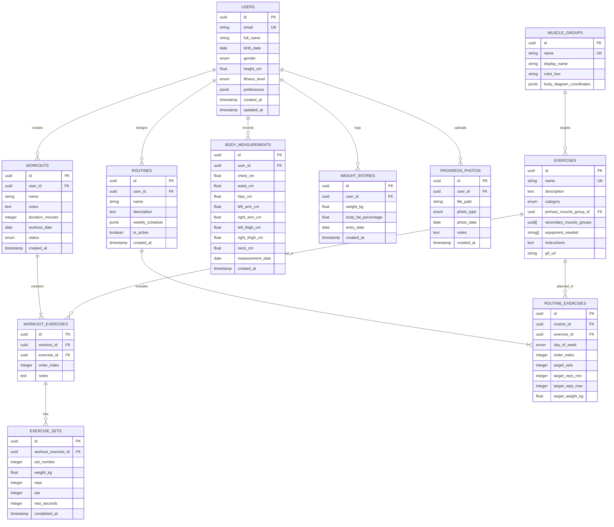

# Arquitectura Técnica - FitTracker Pro v2.0

## 1. Diseño de Arquitectura


## 2. Descripción de Tecnologías

**Frontend:**

* React\@18 + Next.js\@14/15 + TypeScript\@5

* Tailwind CSS\@3 + Headless UI\@1.7

* Chart.js\@4 + Three.js\@0.158 (modelo 3D)

* PWA con Workbox\@7

* Framer Motion\@10 (animaciones)

**Backend:**

* Supabase (PostgreSQL + Auth + Storage + Realtime)

* Edge Functions para lógica serverless

**Deployment:**

* Vercel (Frontend + Edge Functions)

* Supabase Cloud (Backend services)

## 3. Definiciones de Rutas

| Ruta             | Propósito                                    |
| ---------------- | -------------------------------------------- |
| /                | Dashboard principal con métricas y resumen   |
| /auth/login      | Página de autenticación con Supabase Auth    |
| /auth/register   | Registro de nuevos usuarios                  |
| /workouts        | Registro y gestión de entrenamientos         |
| /workouts/\[id]  | Detalle de entrenamiento específico          |
| /routines        | Creación y gestión de rutinas personalizadas |
| /routines/create | Creador de rutinas con drag & drop           |
| /measurements    | Medición corporal con diagrama interactivo   |
| /weight          | Seguimiento de peso corporal y gráficos      |
| /progress        | Galería de fotos de progreso                 |
| /analytics       | Dashboard analítico y reportes               |
| /settings        | Configuración de usuario y preferencias      |
| /profile         | Perfil de usuario y gestión de cuenta        |

## 4. Definiciones de API

### 4.1 APIs Core de Supabase

**Autenticación de Usuario**

```typescript
// Supabase Auth API
POST /auth/v1/signup
POST /auth/v1/token
POST /auth/v1/logout
```

Request (Registro):

| Parámetro | Tipo   | Requerido | Descripción                       |
| --------- | ------ | --------- | --------------------------------- |
| email     | string | true      | Email del usuario                 |
| password  | string | true      | Contraseña (mín. 8 caracteres)    |
| data      | object | false     | Metadatos adicionales del usuario |

Response:

| Parámetro | Tipo    | Descripción                |
| --------- | ------- | -------------------------- |
| user      | User    | Objeto usuario de Supabase |
| session   | Session | Sesión con JWT tokens      |

**Gestión de Entrenamientos**

```typescript
// Supabase Database API via SDK
supabase.from('workouts').select('*')
supabase.from('workouts').insert(workout)
supabase.from('workouts').update(workout).eq('id', id)
```

**Subida de Fotos de Progreso**

```typescript
// Supabase Storage API
supabase.storage.from('progress-photos').upload(path, file)
supabase.storage.from('progress-photos').getPublicUrl(path)
```

### 4.2 Edge Functions Personalizadas

**Análisis de Progreso**

```
POST /functions/v1/analyze-progress
```

Request:

| Parámetro | Tipo   | Requerido | Descripción                           |
| --------- | ------ | --------- | ------------------------------------- |
| user\_id  | uuid   | true      | ID del usuario                        |
| period    | string | true      | Período de análisis (week/month/year) |
| metrics   | array  | false     | Métricas específicas a analizar       |

Response:

| Parámetro       | Tipo   | Descripción                    |
| --------------- | ------ | ------------------------------ |
| progress\_score | number | Puntuación de progreso (0-100) |
| trends          | object | Tendencias por categoría       |
| recommendations | array  | Recomendaciones personalizadas |

**Exportación de Datos**

```
POST /functions/v1/export-data
```

Request:

| Parámetro   | Tipo   | Requerido | Descripción                           |
| ----------- | ------ | --------- | ------------------------------------- |
| user\_id    | uuid   | true      | ID del usuario                        |
| format      | string | true      | Formato de exportación (csv/pdf/json) |
| date\_range | object | false     | Rango de fechas                       |

Response:

| Parámetro     | Tipo      | Descripción                    |
| ------------- | --------- | ------------------------------ |
| download\_url | string    | URL temporal de descarga       |
| expires\_at   | timestamp | Fecha de expiración del enlace |

## 5. Arquitectura del Servidor


## 6. Modelo de Datos

### 6.1 Definición del Modelo de Datos



### 6.2 Lenguaje de Definición de Datos (DDL)

**Tabla de Usuarios**

```sql
-- Crear tabla de usuarios (extendiendo auth.users de Supabase)
CREATE TABLE public.user_profiles (
    id UUID PRIMARY KEY REFERENCES auth.users(id) ON DELETE CASCADE,
    full_name VARCHAR(100) NOT NULL,
    birth_date DATE,
    gender VARCHAR(10) CHECK (gender IN ('male', 'female', 'other')),
    height_cm DECIMAL(5,2),
    fitness_level VARCHAR(20) DEFAULT 'beginner' CHECK (fitness_level IN ('beginner', 'intermediate', 'advanced')),
    preferences JSONB DEFAULT '{}',
    created_at TIMESTAMP WITH TIME ZONE DEFAULT NOW(),
    updated_at TIMESTAMP WITH TIME ZONE DEFAULT NOW()
);

-- RLS (Row Level Security)
ALTER TABLE public.user_profiles ENABLE ROW LEVEL SECURITY;

CREATE POLICY "Users can view own profile" ON public.user_profiles
    FOR SELECT USING (auth.uid() = id);

CREATE POLICY "Users can update own profile" ON public.user_profiles
    FOR UPDATE USING (auth.uid() = id);

-- Permisos
GRANT SELECT, INSERT, UPDATE ON public.user_profiles TO authenticated;
GRANT SELECT ON public.user_profiles TO anon;
```

**Tabla de Entrenamientos**

```sql
CREATE TABLE public.workouts (
    id UUID PRIMARY KEY DEFAULT gen_random_uuid(),
    user_id UUID NOT NULL REFERENCES public.user_profiles(id) ON DELETE CASCADE,
    name VARCHAR(100) NOT NULL,
    notes TEXT,
    duration_minutes INTEGER,
    workout_date DATE NOT NULL DEFAULT CURRENT_DATE,
    status VARCHAR(20) DEFAULT 'planned' CHECK (status IN ('planned', 'in_progress', 'completed', 'skipped')),
    created_at TIMESTAMP WITH TIME ZONE DEFAULT NOW()
);

-- Índices
CREATE INDEX idx_workouts_user_id ON public.workouts(user_id);
CREATE INDEX idx_workouts_date ON public.workouts(workout_date DESC);
CREATE INDEX idx_workouts_status ON public.workouts(status);

-- RLS
ALTER TABLE public.workouts ENABLE ROW LEVEL SECURITY;

CREATE POLICY "Users can manage own workouts" ON public.workouts
    USING (auth.uid() = user_id);

-- Permisos
GRANT ALL PRIVILEGES ON public.workouts TO authenticated;
```

**Tabla de Ejercicios (Datos Maestros)**

```sql
CREATE TABLE public.exercises (
    id UUID PRIMARY KEY DEFAULT gen_random_uuid(),
    name VARCHAR(100) UNIQUE NOT NULL,
    description TEXT,
    category VARCHAR(50) NOT NULL,
    primary_muscle_group_id UUID REFERENCES public.muscle_groups(id),
    secondary_muscle_groups UUID[],
    equipment_needed TEXT[],
    instructions TEXT,
    gif_url VARCHAR(500),
    created_at TIMESTAMP WITH TIME ZONE DEFAULT NOW()
);

-- Índices
CREATE INDEX idx_exercises_category ON public.exercises(category);
CREATE INDEX idx_exercises_muscle_group ON public.exercises(primary_muscle_group_id);

-- Permisos (solo lectura para usuarios)
GRANT SELECT ON public.exercises TO authenticated;
GRANT SELECT ON public.exercises TO anon;
```

**Tabla de Series de Ejercicios**

```sql
CREATE TABLE public.exercise_sets (
    id UUID PRIMARY KEY DEFAULT gen_random_uuid(),
    workout_exercise_id UUID NOT NULL REFERENCES public.workout_exercises(id) ON DELETE CASCADE,
    set_number INTEGER NOT NULL,
    weight_kg DECIMAL(6,2),
    reps INTEGER,
    rpe INTEGER CHECK (rpe >= 1 AND rpe <= 10),
    rest_seconds INTEGER,
    completed_at TIMESTAMP WITH TIME ZONE,
    created_at TIMESTAMP WITH TIME ZONE DEFAULT NOW()
);

-- Índices
CREATE INDEX idx_exercise_sets_workout_exercise ON public.exercise_sets(workout_exercise_id);
CREATE INDEX idx_exercise_sets_completed ON public.exercise_sets(completed_at DESC);

-- RLS
ALTER TABLE public.exercise_sets ENABLE ROW LEVEL SECURITY;

CREATE POLICY "Users can manage own exercise sets" ON public.exercise_sets
    USING (auth.uid() = (SELECT w.user_id FROM public.workouts w 
                        JOIN public.workout_exercises we ON w.id = we.workout_id 
                        WHERE we.id = workout_exercise_id));

-- Permisos
GRANT ALL PRIVILEGES ON public.exercise_sets TO authenticated;
```

**Tabla de Medidas Corporales**

```sql
CREATE TABLE public.body_measurements (
    id UUID PRIMARY KEY DEFAULT gen_random_uuid(),
    user_id UUID NOT NULL REFERENCES public.user_profiles(id) ON DELETE CASCADE,
    chest_cm DECIMAL(5,2),
    waist_cm DECIMAL(5,2),
    hips_cm DECIMAL(5,2),
    left_arm_cm DECIMAL(5,2),
    right_arm_cm DECIMAL(5,2),
    left_thigh_cm DECIMAL(5,2),
    right_thigh_cm DECIMAL(5,2),
    neck_cm DECIMAL(5,2),
    measurement_date DATE NOT NULL DEFAULT CURRENT_DATE,
    created_at TIMESTAMP WITH TIME ZONE DEFAULT NOW()
);

-- Índices
CREATE INDEX idx_body_measurements_user_date ON public.body_measurements(user_id, measurement_date DESC);

-- RLS
ALTER TABLE public.body_measurements ENABLE ROW LEVEL SECURITY;

CREATE POLICY "Users can manage own measurements" ON public.body_measurements
    USING (auth.uid() = user_id);

-- Permisos
GRANT ALL PRIVILEGES ON public.body_measurements TO authenticated;
```

**Datos Iniciales**

```sql
-- Insertar grupos musculares
INSERT INTO public.muscle_groups (name, display_name, color_hex, body_diagram_coordinates) VALUES
('chest', 'Pecho', '#FF6B6B', '{"x": 150, "y": 120, "width": 80, "height": 60}'),
('back', 'Espalda', '#4ECDC4', '{"x": 150, "y": 120, "width": 80, "height": 100}'),
('shoulders', 'Hombros', '#45B7D1', '{"x": 120, "y": 100, "width": 140, "height": 40}'),
('arms', 'Brazos', '#96CEB4', '{"x": 80, "y": 140, "width": 40, "height": 80}'),
('core', 'Core', '#FFEAA7', '{"x": 140, "y": 180, "width": 100, "height": 60}'),
('legs', 'Piernas', '#DDA0DD', '{"x": 130, "y": 280, "width": 120, "height": 160}');

-- Insertar ejercicios básicos
INSERT INTO public.exercises (name, description, category, primary_muscle_group_id, equipment_needed, instructions) VALUES
('Press de Banca', 'Ejercicio fundamental para el desarrollo del pecho', 'strength', 
 (SELECT id FROM public.muscle_groups WHERE name = 'chest'), 
 ARRAY['barbell', 'bench'], 
 'Acuéstate en el banco, agarra la barra con las manos separadas al ancho de los hombros, baja controladamente hasta el pecho y empuja hacia arriba.'),
('Sentadillas', 'Ejercicio compuesto para piernas y glúteos', 'strength',
 (SELECT id FROM public.muscle_groups WHERE name = 'legs'),
 ARRAY['barbell', 'squat_rack'],
 'Coloca la barra sobre los hombros, separa los pies al ancho de los hombros, baja como si te fueras a sentar y vuelve a la posición inicial.');
```

