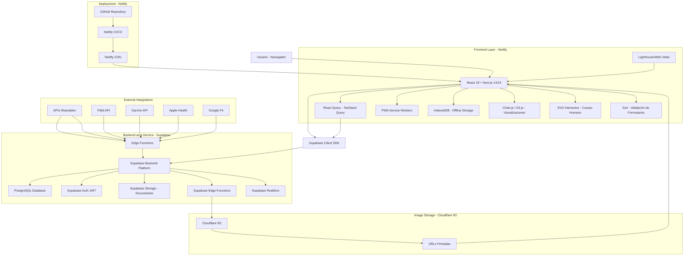
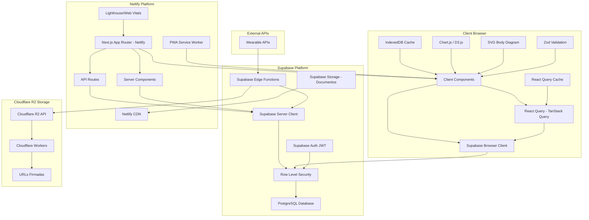
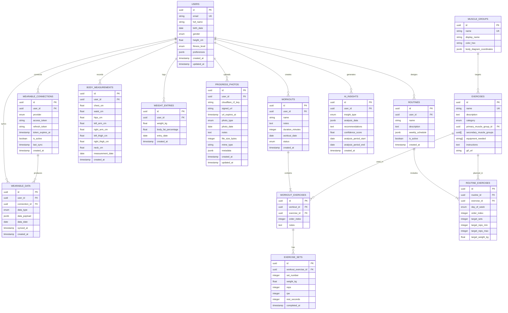

# Arquitectura Técnica - FitTracker Pro v2.0

## 1. Diseño de Arquitectura



## 2. Descripción de Tecnologías

**Frontend:**
- React@18 + Next.js@14/15 + TypeScript@5
- Tailwind CSS@3 para diseño responsivo y componentes reutilizables
- PWA con Service Workers para funcionalidad offline e instalación en dispositivos
- Chart.js@4 / D3.js para visualizaciones de datos y gráficas de evolución física
- SVG interactivo para diagrama del cuerpo humano y registro de medidas por músculo
- Zod@3 / Yup para validación robusta de formularios
- React Query (TanStack Query)@4 para sincronización eficiente con Supabase
- Lighthouse/Web Vitals para medir rendimiento y experiencia de usuario

**Backend:**
- Supabase (PostgreSQL + Auth JWT + Storage + Realtime + Edge Functions)
- Row Level Security (RLS) para seguridad de datos
- APIs REST automáticas y serverless generadas por Supabase
- Edge Functions para lógica personalizada (cálculos, validaciones)

**Almacenamiento de Imágenes:**
- Cloudflare R2 para almacenamiento externo de imágenes de progreso físico
- URLs firmadas y Cloudflare Workers para seguridad y eficiencia
- Sin costo por egress, escalable a miles de usuarios
- Libera carga del storage de Supabase

**Deployment:**
- Netlify (Frontend + PWA + CI/CD automático + integración con GitHub)
- Supabase Cloud (Backend services)
- CDN global para assets estáticos
- Despliegue ágil con integración continua

**Integraciones:**
- APIs de Wearables: Fitbit, Garmin, Apple Health, Google Fit
- Monitoreo continuo de rendimiento con Lighthouse/Web Vitals

## 3. Definiciones de Rutas

| Ruta             | Propósito                                    |
| ---------------- | -------------------------------------------- |
| /                | Dashboard principal con métricas y resumen   |
| /auth/login      | Página de autenticación con Supabase Auth    |
| /auth/register   | Registro de nuevos usuarios                  |
| /workouts        | Registro y gestión de entrenamientos         |
| /workouts/\[id]  | Detalle de entrenamiento específico          |
| /routines        | Creación y gestión de rutinas personalizadas |
| /routines/create | Creador de rutinas con drag & drop           |
| /measurements    | Medición corporal con diagrama interactivo   |
| /weight          | Seguimiento de peso corporal y gráficos      |
| /progress        | Galería de fotos de progreso                 |
| /analytics       | Dashboard analítico y reportes               |
| /settings        | Configuración de usuario y preferencias      |
| /profile         | Perfil de usuario y gestión de cuenta        |

## 4. Definiciones de API

### 4.1 APIs Core de Supabase

**Autenticación de Usuario**

```typescript
// Supabase Auth API
POST /auth/v1/signup
POST /auth/v1/token
POST /auth/v1/logout
```

Request (Registro):

| Parámetro | Tipo   | Requerido | Descripción                       |
| --------- | ------ | --------- | --------------------------------- |
| email     | string | true      | Email del usuario                 |
| password  | string | true      | Contraseña (mín. 8 caracteres)    |
| data      | object | false     | Metadatos adicionales del usuario |

Response:

| Parámetro | Tipo    | Descripción                |
| --------- | ------- | -------------------------- |
| user      | User    | Objeto usuario de Supabase |
| session   | Session | Sesión con JWT tokens      |

**Gestión de Entrenamientos**

```typescript
// Supabase Database API via SDK
supabase.from('workouts').select('*')
supabase.from('workouts').insert(workout)
supabase.from('workouts').update(workout).eq('id', id)
```

**Gestión de Fotos de Progreso con Cloudflare R2**

```typescript
// Edge Function para subir a Cloudflare R2
POST /functions/v1/upload-progress-photo

// Obtener URL firmada para subida directa
POST /functions/v1/get-upload-url

// Obtener URL firmada para visualización
GET /functions/v1/get-photo-url/:photoId
```

Request (Subida):
| Parámetro | Tipo | Requerido | Descripción |
|-----------|------|-----------|-------------|
| file | File | true | Archivo de imagen (JPEG/PNG) |
| photo_type | string | true | Tipo de foto (front/side/back) |
| notes | string | false | Notas adicionales |

Response:
| Parámetro | Tipo | Descripción |
|-----------|------|-------------|
| photo_id | uuid | ID único de la foto |
| upload_url | string | URL firmada para subida |
| expires_at | timestamp | Expiración de la URL |

**Almacenamiento de Documentos (Supabase Storage)**

```typescript
// Para documentos y archivos no críticos
supabase.storage.from('documents').upload(path, file)
supabase.storage.from('documents').getPublicUrl(path)
```

### 4.2 Edge Functions Personalizadas

**Análisis de Progreso con IA**

```
POST /functions/v1/analyze-progress
```

Request:

| Parámetro | Tipo   | Requerido | Descripción                           |
| --------- | ------ | --------- | ------------------------------------- |
| user\_id  | uuid   | true      | ID del usuario                        |
| period    | string | true      | Período de análisis (week/month/year) |
| metrics   | array  | false     | Métricas específicas a analizar       |

Response:

| Parámetro       | Tipo   | Descripción                    |
| --------------- | ------ | ------------------------------ |
| progress\_score | number | Puntuación de progreso (0-100) |
| trends          | object | Tendencias por categoría       |
| recommendations | array  | Recomendaciones personalizadas |
| ai\_insights    | object | Análisis con inteligencia artificial |

**Sincronización con Wearables**

```
POST /functions/v1/sync-wearable
```

Request:

| Parámetro | Tipo   | Requerido | Descripción                    |
| --------- | ------ | --------- | ------------------------------ |
| user\_id  | uuid   | true      | ID del usuario                 |
| provider  | string | true      | Proveedor (fitbit/garmin/apple/google) |
| auth\_token | string | true    | Token de autorización del wearable |

Response:

| Parámetro     | Tipo    | Descripción                    |
| ------------- | ------- | ------------------------------ |
| synced\_data  | object  | Datos sincronizados            |
| last\_sync    | timestamp | Última sincronización        |

**Exportación de Datos**

```
POST /functions/v1/export-data
```

Request:

| Parámetro   | Tipo   | Requerido | Descripción                           |
| ----------- | ------ | --------- | ------------------------------------- |
| user\_id    | uuid   | true      | ID del usuario                        |
| format      | string | true      | Formato de exportación (csv/pdf/json) |
| date\_range | object | false     | Rango de fechas                       |
| include\_photos | boolean | false | Incluir fotos de progreso          |

Response:

| Parámetro     | Tipo      | Descripción                    |
| ------------- | --------- | ------------------------------ |
| download\_url | string    | URL temporal de descarga       |
| expires\_at   | timestamp | Fecha de expiración del enlace |
| file\_size    | number    | Tamaño del archivo en bytes    |

## 5. Arquitectura del Servidor



## 6. Modelo de Datos

### 6.1 Definición del Modelo de Datos



### 6.2 Lenguaje de Definición de Datos (DDL)

**Tabla de Usuarios**

```sql
-- Crear tabla de usuarios (extendiendo auth.users de Supabase)
CREATE TABLE public.user_profiles (
    id UUID PRIMARY KEY REFERENCES auth.users(id) ON DELETE CASCADE,
    full_name VARCHAR(100) NOT NULL,
    birth_date DATE,
    gender VARCHAR(10) CHECK (gender IN ('male', 'female', 'other')),
    height_cm DECIMAL(5,2),
    fitness_level VARCHAR(20) DEFAULT 'beginner' CHECK (fitness_level IN ('beginner', 'intermediate', 'advanced')),
    preferences JSONB DEFAULT '{}',
    created_at TIMESTAMP WITH TIME ZONE DEFAULT NOW(),
    updated_at TIMESTAMP WITH TIME ZONE DEFAULT NOW()
);

-- RLS (Row Level Security)
ALTER TABLE public.user_profiles ENABLE ROW LEVEL SECURITY;

CREATE POLICY "Users can view own profile" ON public.user_profiles
    FOR SELECT USING (auth.uid() = id);

CREATE POLICY "Users can update own profile" ON public.user_profiles
    FOR UPDATE USING (auth.uid() = id);

-- Permisos
GRANT SELECT, INSERT, UPDATE ON public.user_profiles TO authenticated;
GRANT SELECT ON public.user_profiles TO anon;
```

**Tabla de Entrenamientos**

```sql
CREATE TABLE public.workouts (
    id UUID PRIMARY KEY DEFAULT gen_random_uuid(),
    user_id UUID NOT NULL REFERENCES public.user_profiles(id) ON DELETE CASCADE,
    name VARCHAR(200) NOT NULL,
    notes TEXT,
    duration_minutes INTEGER,
    workout_date DATE NOT NULL,
    status VARCHAR(20) DEFAULT 'planned' CHECK (status IN ('planned', 'in_progress', 'completed', 'skipped')),
    created_at TIMESTAMP WITH TIME ZONE DEFAULT NOW(),
    updated_at TIMESTAMP WITH TIME ZONE DEFAULT NOW()
);

-- RLS para workouts
ALTER TABLE public.workouts ENABLE ROW LEVEL SECURITY;

CREATE POLICY "Users can manage own workouts" ON public.workouts
    FOR ALL USING (auth.uid() = user_id);

GRANT ALL PRIVILEGES ON public.workouts TO authenticated;
GRANT SELECT ON public.workouts TO anon;

**Tabla de Conexiones de Wearables**

```sql
CREATE TABLE public.wearable_connections (
    id UUID PRIMARY KEY DEFAULT gen_random_uuid(),
    user_id UUID NOT NULL REFERENCES public.user_profiles(id) ON DELETE CASCADE,
    provider VARCHAR(20) NOT NULL CHECK (provider IN ('fitbit', 'garmin', 'apple_health', 'google_fit')),
    access_token TEXT NOT NULL,
    refresh_token TEXT,
    token_expires_at TIMESTAMP WITH TIME ZONE,
    is_active BOOLEAN DEFAULT true,
    last_sync TIMESTAMP WITH TIME ZONE,
    created_at TIMESTAMP WITH TIME ZONE DEFAULT NOW(),
    updated_at TIMESTAMP WITH TIME ZONE DEFAULT NOW(),
    UNIQUE(user_id, provider)
);

-- RLS para wearable_connections
ALTER TABLE public.wearable_connections ENABLE ROW LEVEL SECURITY;

CREATE POLICY "Users can manage own wearable connections" ON public.wearable_connections
    FOR ALL USING (auth.uid() = user_id);

GRANT ALL PRIVILEGES ON public.wearable_connections TO authenticated;

**Tabla de Datos de Wearables**

```sql
CREATE TABLE public.wearable_data (
    id UUID PRIMARY KEY DEFAULT gen_random_uuid(),
    user_id UUID NOT NULL REFERENCES public.user_profiles(id) ON DELETE CASCADE,
    connection_id UUID NOT NULL REFERENCES public.wearable_connections(id) ON DELETE CASCADE,
    data_type VARCHAR(50) NOT NULL CHECK (data_type IN ('steps', 'heart_rate', 'calories', 'sleep', 'activity', 'weight')),
    data_payload JSONB NOT NULL,
    data_date DATE NOT NULL,
    synced_at TIMESTAMP WITH TIME ZONE DEFAULT NOW(),
    created_at TIMESTAMP WITH TIME ZONE DEFAULT NOW(),
    UNIQUE(user_id, connection_id, data_type, data_date)
);

-- Índices para wearable_data
CREATE INDEX idx_wearable_data_user_date ON public.wearable_data(user_id, data_date DESC);
CREATE INDEX idx_wearable_data_type ON public.wearable_data(data_type, data_date DESC);

-- RLS para wearable_data
ALTER TABLE public.wearable_data ENABLE ROW LEVEL SECURITY;

CREATE POLICY "Users can view own wearable data" ON public.wearable_data
    FOR SELECT USING (auth.uid() = user_id);

CREATE POLICY "System can insert wearable data" ON public.wearable_data
    FOR INSERT WITH CHECK (auth.uid() = user_id);

GRANT SELECT, INSERT ON public.wearable_data TO authenticated;

**Tabla de Insights de IA**

```sql
CREATE TABLE public.ai_insights (
    id UUID PRIMARY KEY DEFAULT gen_random_uuid(),
    user_id UUID NOT NULL REFERENCES public.user_profiles(id) ON DELETE CASCADE,
    insight_type VARCHAR(50) NOT NULL CHECK (insight_type IN ('progress_analysis', 'workout_recommendation', 'nutrition_advice', 'recovery_suggestion')),
    analysis_data JSONB NOT NULL,
    recommendations TEXT,
    confidence_score DECIMAL(3,2) CHECK (confidence_score >= 0 AND confidence_score <= 1),
    analysis_period_start DATE NOT NULL,
    analysis_period_end DATE NOT NULL,
    created_at TIMESTAMP WITH TIME ZONE DEFAULT NOW()
);

-- Índices para ai_insights
CREATE INDEX idx_ai_insights_user_type ON public.ai_insights(user_id, insight_type, created_at DESC);
CREATE INDEX idx_ai_insights_confidence ON public.ai_insights(confidence_score DESC);

-- RLS para ai_insights
ALTER TABLE public.ai_insights ENABLE ROW LEVEL SECURITY;

CREATE POLICY "Users can view own AI insights" ON public.ai_insights
    FOR SELECT USING (auth.uid() = user_id);

GRANT SELECT ON public.ai_insights TO authenticated;
GRANT INSERT ON public.ai_insights TO service_role; -- Solo para Edge Functions
    name VARCHAR(100) NOT NULL,
    notes TEXT,
    duration_minutes INTEGER,
    workout_date DATE NOT NULL DEFAULT CURRENT_DATE,
    status VARCHAR(20) DEFAULT 'planned' CHECK (status IN ('planned', 'in_progress', 'completed', 'skipped')),
    created_at TIMESTAMP WITH TIME ZONE DEFAULT NOW()
);

-- Índices
CREATE INDEX idx_workouts_user_id ON public.workouts(user_id);
CREATE INDEX idx_workouts_date ON public.workouts(workout_date DESC);
CREATE INDEX idx_workouts_status ON public.workouts(status);

-- RLS
ALTER TABLE public.workouts ENABLE ROW LEVEL SECURITY;

CREATE POLICY "Users can manage own workouts" ON public.workouts
    USING (auth.uid() = user_id);

-- Permisos
GRANT ALL PRIVILEGES ON public.workouts TO authenticated;
```

**Tabla de Ejercicios (Datos Maestros)**

```sql
CREATE TABLE public.exercises (
    id UUID PRIMARY KEY DEFAULT gen_random_uuid(),
    name VARCHAR(100) UNIQUE NOT NULL,
    description TEXT,
    category VARCHAR(50) NOT NULL,
    primary_muscle_group_id UUID REFERENCES public.muscle_groups(id),
    secondary_muscle_groups UUID[],
    equipment_needed TEXT[],
    instructions TEXT,
    gif_url VARCHAR(500),
    created_at TIMESTAMP WITH TIME ZONE DEFAULT NOW()
);

-- Índices
CREATE INDEX idx_exercises_category ON public.exercises(category);
CREATE INDEX idx_exercises_muscle_group ON public.exercises(primary_muscle_group_id);

-- Permisos (solo lectura para usuarios)
GRANT SELECT ON public.exercises TO authenticated;
GRANT SELECT ON public.exercises TO anon;
```

**Tabla de Series de Ejercicios**

```sql
CREATE TABLE public.exercise_sets (
    id UUID PRIMARY KEY DEFAULT gen_random_uuid(),
    workout_exercise_id UUID NOT NULL REFERENCES public.workout_exercises(id) ON DELETE CASCADE,
    set_number INTEGER NOT NULL,
    weight_kg DECIMAL(6,2),
    reps INTEGER,
    rpe INTEGER CHECK (rpe >= 1 AND rpe <= 10),
    rest_seconds INTEGER,
    completed_at TIMESTAMP WITH TIME ZONE,
    created_at TIMESTAMP WITH TIME ZONE DEFAULT NOW()
);

-- Índices
CREATE INDEX idx_exercise_sets_workout_exercise ON public.exercise_sets(workout_exercise_id);
CREATE INDEX idx_exercise_sets_completed ON public.exercise_sets(completed_at DESC);

-- RLS
ALTER TABLE public.exercise_sets ENABLE ROW LEVEL SECURITY;

CREATE POLICY "Users can manage own exercise sets" ON public.exercise_sets
    USING (auth.uid() = (SELECT w.user_id FROM public.workouts w 
                        JOIN public.workout_exercises we ON w.id = we.workout_id 
                        WHERE we.id = workout_exercise_id));

-- Permisos
GRANT ALL PRIVILEGES ON public.exercise_sets TO authenticated;
```

**Tabla de Medidas Corporales**

```sql
CREATE TABLE public.body_measurements (
    id UUID PRIMARY KEY DEFAULT gen_random_uuid(),
    user_id UUID NOT NULL REFERENCES public.user_profiles(id) ON DELETE CASCADE,
    chest_cm DECIMAL(5,2),
    waist_cm DECIMAL(5,2),
    hips_cm DECIMAL(5,2),
    left_arm_cm DECIMAL(5,2),
    right_arm_cm DECIMAL(5,2),
    left_thigh_cm DECIMAL(5,2),
    right_thigh_cm DECIMAL(5,2),
    neck_cm DECIMAL(5,2),
    measurement_date DATE NOT NULL DEFAULT CURRENT_DATE,
    created_at TIMESTAMP WITH TIME ZONE DEFAULT NOW()
);

-- Índices
CREATE INDEX idx_body_measurements_user_date ON public.body_measurements(user_id, measurement_date DESC);

-- RLS
ALTER TABLE public.body_measurements ENABLE ROW LEVEL SECURITY;

CREATE POLICY "Users can manage own measurements" ON public.body_measurements
    USING (auth.uid() = user_id);

-- Permisos
GRANT ALL PRIVILEGES ON public.body_measurements TO authenticated;
```

**Tabla de Fotos de Progreso (Cloudflare R2)**

```sql
CREATE TABLE public.progress_photos (
    id UUID PRIMARY KEY DEFAULT gen_random_uuid(),
    user_id UUID NOT NULL REFERENCES public.user_profiles(id) ON DELETE CASCADE,
    cloudflare_r2_key VARCHAR(500) NOT NULL,
    signed_url TEXT,
    url_expires_at TIMESTAMP WITH TIME ZONE,
    photo_type VARCHAR(20) NOT NULL CHECK (photo_type IN ('front', 'side', 'back', 'custom')),
    photo_date DATE NOT NULL DEFAULT CURRENT_DATE,
    notes TEXT,
    file_size_bytes INTEGER,
    mime_type VARCHAR(50) CHECK (mime_type IN ('image/jpeg', 'image/png', 'image/webp')),
    metadata JSONB DEFAULT '{}',
    created_at TIMESTAMP WITH TIME ZONE DEFAULT NOW(),
    updated_at TIMESTAMP WITH TIME ZONE DEFAULT NOW()
);

-- Índices
CREATE INDEX idx_progress_photos_user_date ON public.progress_photos(user_id, photo_date DESC);
CREATE INDEX idx_progress_photos_type ON public.progress_photos(photo_type, photo_date DESC);
CREATE INDEX idx_progress_photos_r2_key ON public.progress_photos(cloudflare_r2_key);

-- RLS
ALTER TABLE public.progress_photos ENABLE ROW LEVEL SECURITY;

CREATE POLICY "Users can manage own progress photos" ON public.progress_photos
    USING (auth.uid() = user_id);

-- Permisos
GRANT ALL PRIVILEGES ON public.progress_photos TO authenticated;

-- Función para actualizar updated_at
CREATE OR REPLACE FUNCTION update_updated_at_column()
RETURNS TRIGGER AS $$
BEGIN
    NEW.updated_at = NOW();
    RETURN NEW;
END;
$$ language 'plpgsql';

CREATE TRIGGER update_progress_photos_updated_at BEFORE UPDATE
    ON public.progress_photos FOR EACH ROW EXECUTE FUNCTION update_updated_at_column();
```

**Datos Iniciales**

```sql
-- Insertar grupos musculares
INSERT INTO public.muscle_groups (name, display_name, color_hex, body_diagram_coordinates) VALUES
('chest', 'Pecho', '#FF6B6B', '{"x": 150, "y": 120, "width": 80, "height": 60}'),
('back', 'Espalda', '#4ECDC4', '{"x": 150, "y": 120, "width": 80, "height": 100}'),
('shoulders', 'Hombros', '#45B7D1', '{"x": 120, "y": 100, "width": 140, "height": 40}'),
('arms', 'Brazos', '#96CEB4', '{"x": 80, "y": 140, "width": 40, "height": 80}'),
('core', 'Core', '#FFEAA7', '{"x": 140, "y": 180, "width": 100, "height": 60}'),
('legs', 'Piernas', '#DDA0DD', '{"x": 130, "y": 280, "width": 120, "height": 160}');

-- Insertar ejercicios básicos
INSERT INTO public.exercises (name, description, category, primary_muscle_group_id, equipment_needed, instructions) VALUES
('Press de Banca', 'Ejercicio fundamental para el desarrollo del pecho', 'strength', 
 (SELECT id FROM public.muscle_groups WHERE name = 'chest'), 
 ARRAY['barbell', 'bench'], 
 'Acuéstate en el banco, agarra la barra con las manos separadas al ancho de los hombros, baja controladamente hasta el pecho y empuja hacia arriba.'),
('Sentadillas', 'Ejercicio compuesto para piernas y glúteos', 'strength',
 (SELECT id FROM public.muscle_groups WHERE name = 'legs'),
 ARRAY['barbell', 'squat_rack'],
 'Coloca la barra sobre los hombros, separa los pies al ancho de los hombros, baja como si te fueras a sentar y vuelve a la posición inicial.');
```

## 7. Implementación de Cloudflare R2

### 7.1 Edge Functions para Cloudflare R2

**Configuración de Variables de Entorno**

```bash
# Supabase Edge Functions
CLOUDFLARE_R2_ACCESS_KEY_ID=your_access_key
CLOUDFLARE_R2_SECRET_ACCESS_KEY=your_secret_key
CLOUDFLARE_R2_BUCKET_NAME=fittracker-progress-photos
CLOUDFLARE_R2_ENDPOINT=https://your-account-id.r2.cloudflarestorage.com
CLOUDFLARE_R2_PUBLIC_URL=https://your-custom-domain.com
```

**Edge Function: upload-progress-photo**

```typescript
import { serve } from 'https://deno.land/std@0.168.0/http/server.ts'
import { createClient } from 'https://esm.sh/@supabase/supabase-js@2'
import { S3Client, PutObjectCommand } from 'https://esm.sh/@aws-sdk/client-s3@3'
import { getSignedUrl } from 'https://esm.sh/@aws-sdk/s3-request-presigner@3'

const corsHeaders = {
  'Access-Control-Allow-Origin': '*',
  'Access-Control-Allow-Headers': 'authorization, x-client-info, apikey, content-type',
}

serve(async (req) => {
  if (req.method === 'OPTIONS') {
    return new Response('ok', { headers: corsHeaders })
  }

  try {
    const supabase = createClient(
      Deno.env.get('SUPABASE_URL') ?? '',
      Deno.env.get('SUPABASE_ANON_KEY') ?? '',
      { global: { headers: { Authorization: req.headers.get('Authorization')! } } }
    )

    const { data: { user } } = await supabase.auth.getUser()
    if (!user) throw new Error('Unauthorized')

    const { photo_type, notes } = await req.json()
    
    // Configurar cliente S3 para Cloudflare R2
    const s3Client = new S3Client({
      region: 'auto',
      endpoint: Deno.env.get('CLOUDFLARE_R2_ENDPOINT'),
      credentials: {
        accessKeyId: Deno.env.get('CLOUDFLARE_R2_ACCESS_KEY_ID')!,
        secretAccessKey: Deno.env.get('CLOUDFLARE_R2_SECRET_ACCESS_KEY')!,
      },
    })

    // Generar clave única para R2
    const photoId = crypto.randomUUID()
    const r2Key = `progress-photos/${user.id}/${photoId}.jpg`
    
    // Crear comando para subida
    const putCommand = new PutObjectCommand({
      Bucket: Deno.env.get('CLOUDFLARE_R2_BUCKET_NAME'),
      Key: r2Key,
      ContentType: 'image/jpeg',
      Metadata: {
        userId: user.id,
        photoType: photo_type,
      },
    })

    // Generar URL firmada para subida (válida por 1 hora)
    const uploadUrl = await getSignedUrl(s3Client, putCommand, { expiresIn: 3600 })
    
    // Guardar registro en base de datos
    const { data: photo, error } = await supabase
      .from('progress_photos')
      .insert({
        id: photoId,
        user_id: user.id,
        cloudflare_r2_key: r2Key,
        photo_type,
        notes,
        url_expires_at: new Date(Date.now() + 3600 * 1000).toISOString(),
      })
      .select()
      .single()

    if (error) throw error

    return new Response(
      JSON.stringify({
        photo_id: photoId,
        upload_url: uploadUrl,
        expires_at: new Date(Date.now() + 3600 * 1000).toISOString(),
      }),
      {
        headers: { ...corsHeaders, 'Content-Type': 'application/json' },
        status: 200,
      }
    )
  } catch (error) {
    return new Response(
      JSON.stringify({ error: error.message }),
      {
        headers: { ...corsHeaders, 'Content-Type': 'application/json' },
        status: 400,
      }
    )
  }
})
```

**Edge Function: get-photo-url**

```typescript
import { serve } from 'https://deno.land/std@0.168.0/http/server.ts'
import { createClient } from 'https://esm.sh/@supabase/supabase-js@2'
import { S3Client, GetObjectCommand } from 'https://esm.sh/@aws-sdk/client-s3@3'
import { getSignedUrl } from 'https://esm.sh/@aws-sdk/s3-request-presigner@3'

serve(async (req) => {
  try {
    const url = new URL(req.url)
    const photoId = url.pathname.split('/').pop()
    
    const supabase = createClient(
      Deno.env.get('SUPABASE_URL') ?? '',
      Deno.env.get('SUPABASE_ANON_KEY') ?? '',
      { global: { headers: { Authorization: req.headers.get('Authorization')! } } }
    )

    const { data: { user } } = await supabase.auth.getUser()
    if (!user) throw new Error('Unauthorized')

    // Obtener información de la foto
    const { data: photo, error } = await supabase
      .from('progress_photos')
      .select('*')
      .eq('id', photoId)
      .eq('user_id', user.id)
      .single()

    if (error || !photo) throw new Error('Photo not found')

    // Verificar si la URL firmada aún es válida
    const now = new Date()
    const expiresAt = new Date(photo.url_expires_at)
    
    if (photo.signed_url && now < expiresAt) {
      return new Response(
        JSON.stringify({ signed_url: photo.signed_url, expires_at: photo.url_expires_at }),
        { headers: { 'Content-Type': 'application/json' } }
      )
    }

    // Generar nueva URL firmada
    const s3Client = new S3Client({
      region: 'auto',
      endpoint: Deno.env.get('CLOUDFLARE_R2_ENDPOINT'),
      credentials: {
        accessKeyId: Deno.env.get('CLOUDFLARE_R2_ACCESS_KEY_ID')!,
        secretAccessKey: Deno.env.get('CLOUDFLARE_R2_SECRET_ACCESS_KEY')!,
      },
    })

    const getCommand = new GetObjectCommand({
      Bucket: Deno.env.get('CLOUDFLARE_R2_BUCKET_NAME'),
      Key: photo.cloudflare_r2_key,
    })

    const signedUrl = await getSignedUrl(s3Client, getCommand, { expiresIn: 3600 })
    const newExpiresAt = new Date(Date.now() + 3600 * 1000).toISOString()

    // Actualizar URL en base de datos
    await supabase
      .from('progress_photos')
      .update({
        signed_url: signedUrl,
        url_expires_at: newExpiresAt,
      })
      .eq('id', photoId)

    return new Response(
      JSON.stringify({ signed_url: signedUrl, expires_at: newExpiresAt }),
      { headers: { 'Content-Type': 'application/json' } }
    )
  } catch (error) {
    return new Response(
      JSON.stringify({ error: error.message }),
      { headers: { 'Content-Type': 'application/json' }, status: 400 }
    )
  }
})
```

### 7.2 Mejores Prácticas

**Seguridad:**
- URLs firmadas con expiración corta (1 hora)
- Validación de tipos de archivo (JPEG, PNG, WebP)
- Límites de tamaño de archivo (máx. 10MB)
- Autenticación obligatoria para todas las operaciones

**Rendimiento:**
- Cache de URLs firmadas en base de datos
- Compresión automática de imágenes
- CDN de Cloudflare para entrega global
- Lazy loading en el frontend

**Escalabilidad:**
- Sin costo por egress de datos
- Almacenamiento ilimitado
- Integración con Cloudflare Workers para procesamiento
- Backup automático y versionado
```

